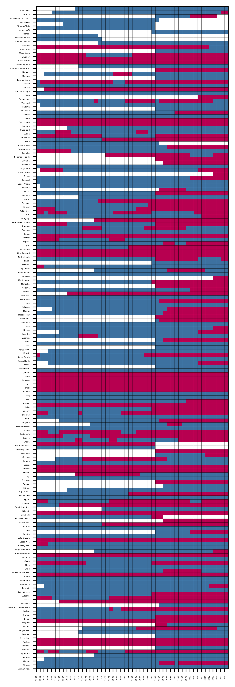
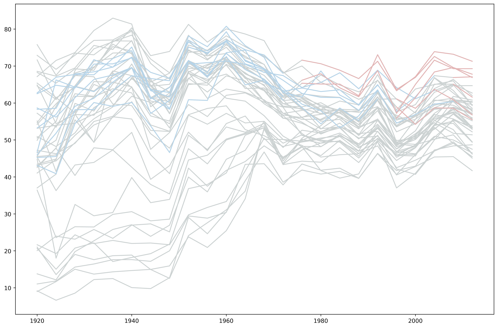

# pyreg
用python跑regression学习中
## panelView
隔离打不过怪物猎人，只好用学习抚慰自己的内心，灵（抄）感（袭）来自徐老师的[panelview](https://github.com/xuyiqing/panelView)项目。
项目reference：
- [panelview](https://github.com/xuyiqing/panelView)
- [MHR弓箭出装推荐](https://www.caimogu.net/post/22816.html)
- [MHR轻弩出装推荐](https://www.caimogu.net/post/22221.html)

目前只有两个最简单的功能：

- 查看treatment和missing value

- 折线图看you treatment的折线

